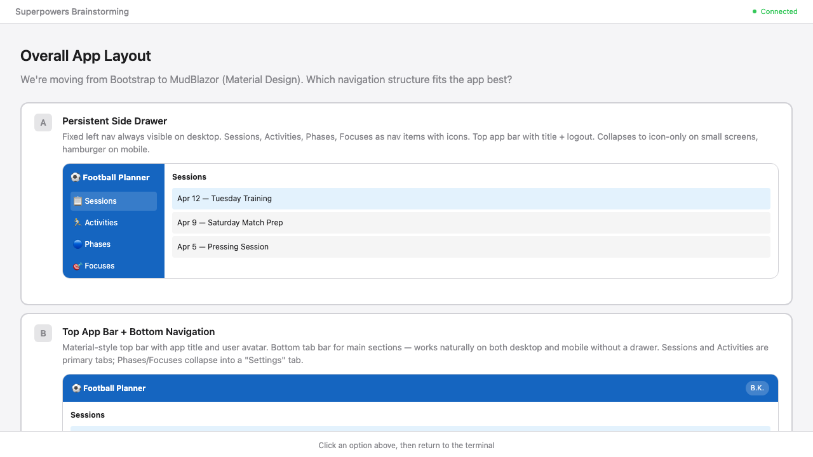
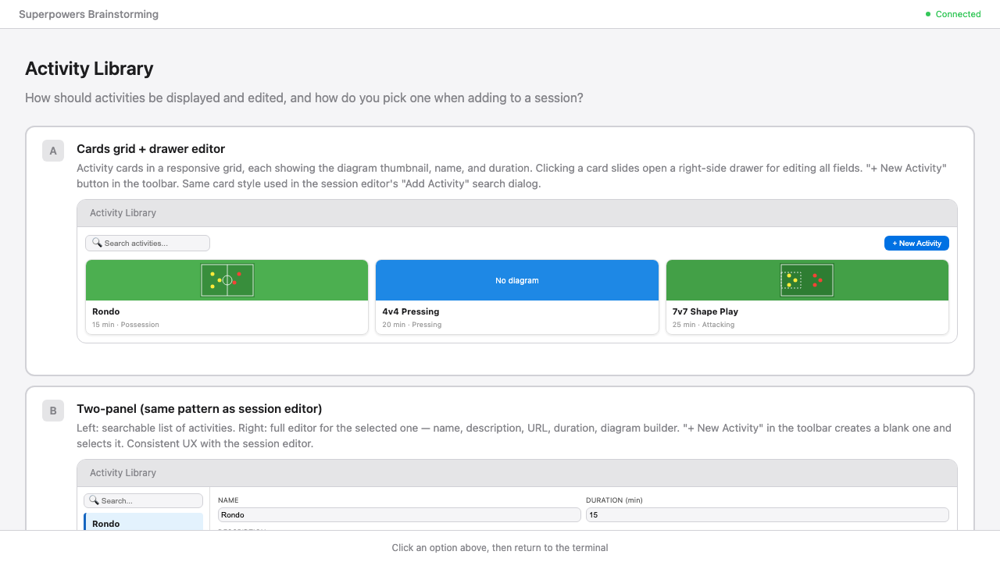
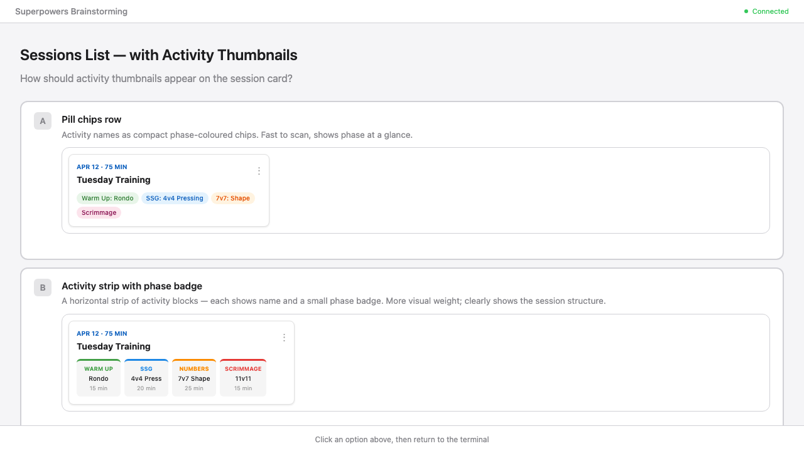
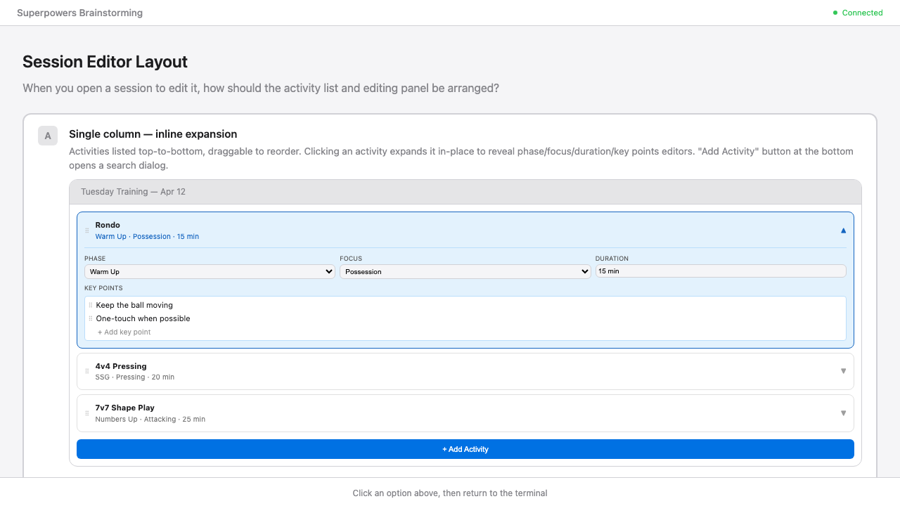
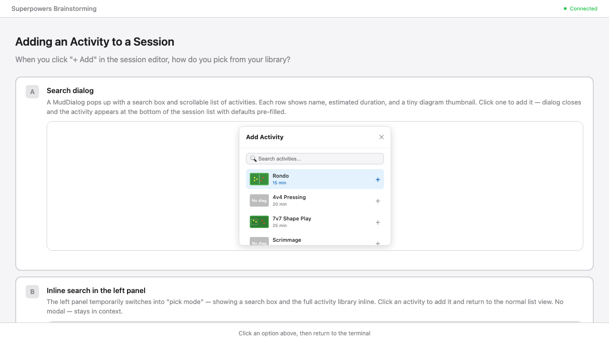
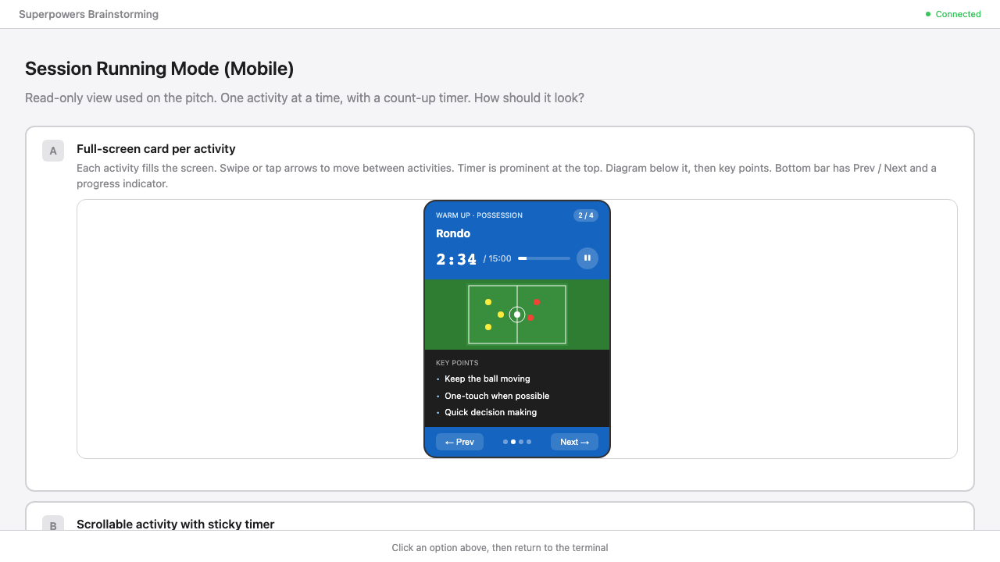

# MudBlazor UI Overhaul + Session Running Mode — Design Spec

**Date:** 2026-04-12

## Overview

Replace Bootstrap with MudBlazor (Material Design) across all Blazor pages. Deliver usable, polished UI for session planning and activity management. Add the Session Running Mode (mobile view with timer) which is missing from the current implementation.

---

## Design Decisions

### Framework
- **Remove:** Bootstrap (CSS + JS vendored in `wwwroot/lib/bootstrap/`)
- **Add:** MudBlazor (latest stable, currently 7.x) via NuGet + CDN CSS/JS in `index.html`
- **Primary colour:** Orange — `#E65100` (Material Deep Orange 900) as `MudTheme` primary. Accent: `#FF6D00`.
- All C# inline in `@code {}` blocks — no `.razor.cs` code-behind files.

### Layout
`MudLayout` with a persistent `MudDrawer` on the left. `MudAppBar` at the top with the app title and a user avatar/logout button. The drawer contains a `MudNavMenu` with four items: Sessions, Activities, Phases, Focuses — each with a Material icon. On mobile the drawer collapses; the app bar shows a hamburger toggle.

---

## Pages

### Phases (`/phases`) and Focuses (`/focuses`)

Two-panel layout using `MudGrid`. Left panel: `MudList` of existing items (ordered by DisplayOrder for Phases). Right panel: a form for the selected item (name field, save/delete buttons). A "+ New" `MudFab` creates a blank entry and selects it. Inline create — no separate dialog needed.

### Activity Library (`/activities`)

Two-panel layout. Left panel: searchable `MudList` (filter by name as you type). Right panel: editor for the selected activity — name, description, inspiration URL (with open-link icon button), estimated duration. A placeholder card for the pitch diagram builder (future feature — click opens nothing for now). "+ New Activity" `MudFab` creates a blank entry.

### Sessions List (`/sessions`)

`MudGrid` of session cards grouped by month header (`MudText` subtitle). Each `MudCard` shows:
- Date (formatted as "Apr 12") and total session duration (sum of activity durations)
- Session title
- Horizontal scrollable strip of activity diagram thumbnails — small SVG pitch previews (`60×38` viewBox, green background) or a labelled placeholder chip when `DiagramJson` is null
- `MudIconButton` (⋮) opens a `MudMenu` with: Edit (opens dialog), Delete (with confirmation), Run Session (navigates to `/sessions/{id}/run`)

"+ New Session" `MudFab` opens a `MudDialog` with date picker, title field, and optional notes textarea.

### Session Editor (`/sessions/{id}`)

Two-panel layout via `MudGrid`.

**Left panel — activity list:**
- Each row is a `MudPaper` with a drag handle (using `MudBlazor`'s drag-and-drop or a simple up/down button pair), activity name, phase name, and duration.
- Selected row is highlighted with the primary colour.
- "Remove" icon button on each row.
- "+ Add Activity" `MudFab` at the bottom opens the Activity Picker dialog.

**Right panel — detail editor (for selected activity):**
- Activity name as a read-only heading (it's a library reference — edit the activity itself in the library).
- `MudSelect` for Phase, `MudSelect` for Focus, `MudNumericField` for Duration.
- Key points section: ordered list of `MudTextField` rows, each with a drag handle and a remove button. "+ Add Key Point" link at the bottom.
- Notes `MudTextField` (multiline).
- Auto-saves on field blur (no explicit Save button needed for the detail panel).

**Session header:**
- Title, date, back link to Sessions.
- "Edit Details" `MudIconButton` opens a `MudDialog` for date/title/notes.
- "Run Session" `MudButton` navigates to `/sessions/{id}/run`.

**Activity Picker dialog (`MudDialog`):**

- Search `MudTextField` filters the activity list as you type.
- Scrollable list: each row shows a small diagram thumbnail, activity name, and estimated duration. Click a row to add it to the session (with default phase = first phase, focus = first focus, duration = activity's EstimatedDuration) and close the dialog.

### Session Running Mode (`/sessions/{id}/run`)

New page at `/sessions/{id}/run`. Mobile-optimised dark theme (override `MudTheme` palette for this page's `MudPaper` to dark background `#121212`, text white).

**Sticky header (`MudAppBar` or fixed `MudPaper`):**
- Activity name (bold)
- Phase name
- Progress indicator: "2 / 4"
- Count-up timer: `MM:SS` / `MM:SS` (elapsed / estimated duration) with a `MudProgressLinear` bar
- Pause/Resume `MudIconButton`

**Scrollable content area:**
- Pitch diagram SVG (scaled to viewport width, or placeholder if none)
- Key points: `MudList` with bullet points

**Navigation at bottom of content:**
- "← Prev" and "Next →" `MudButton` pair
- Dot progress indicator

**Timer logic:** JavaScript `setInterval` via `IJSRuntime` — increments a `TimeSpan` every second, calls `StateHasChanged`. Pausing clears the interval. Navigating to a new activity resets the timer to 0 and auto-starts it.

**Access:** Only reachable from the Session Editor header button or the session card's ⋮ menu. Not shown in the main nav.

---

## Implementation Breakdown

This spec is split into three sequential implementation plans:

1. **MudBlazor Foundation + Simple Pages** — install MudBlazor, configure theme, replace layout, overhaul Phases, Focuses, and Activity Library pages.
2. **Sessions UI Overhaul** — sessions list with diagram thumbnail cards, session editor two-panel with drag-reorder and key points list, activity picker dialog.
3. **Session Running Mode** — new `/sessions/{id}/run` page with sticky timer and mobile dark theme.
